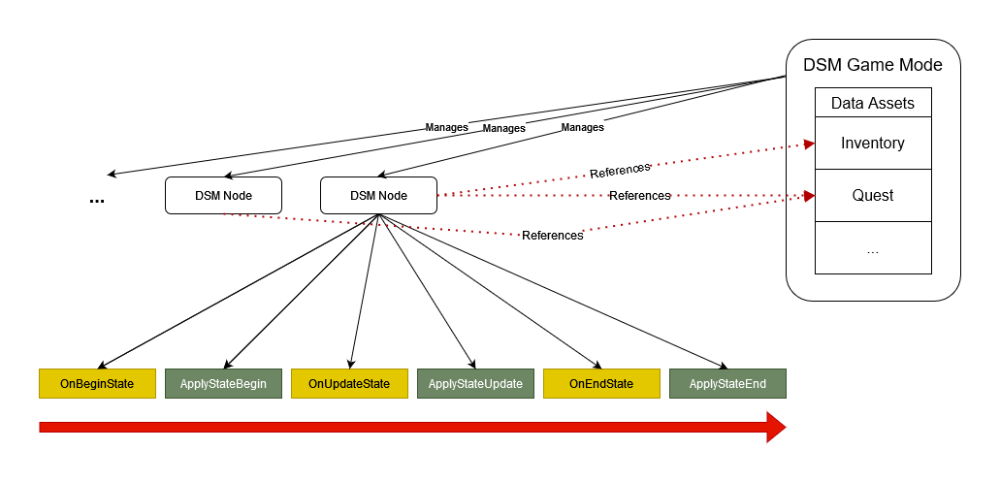

# Create DSM Nodes

## Theory

DSM nodes define gameplay behavior without storing any data by itself. Instead, a node can reference data, which is globally managed by the ```DSMGameMode```. We distinguish between two different kinds of behaviors inside a ```DSM Node``` :

1. **Data Updates :** Code only related to ```DSM Data Assets``` . Updates referenced ```DSM Data Assets``` based on the ```DSM Node``` behavior. No world changes are allowed during this update step.

2. **Environement Updates :** Code, which consumes the updated ```DSM Data Assets``` and applies the changes to the world. All world changes should be done in this step. Data references should only be updated in this step, if the field in the ```DSM Data Asset``` is related to the world. (E.g. a widget instance) 



It is important to mention that each data asset instance is unique in the world. So if two ```DSM Nodes``` reference the same ```DSM Data Asset```, this means that any changes made from one node is visible by the other ```DSM Node```. In order to continue the example with the inventory, this has the following impact. If we collect an item, the action of collecting the item could be a DSM Node which references the inventory. So if the node is activated, we would add the item to the inventory during the ```Data Update``` and then destroy the item from the world during the ```Environement Update```. Later in the game there another node is activated, which consumes the item. The action of consuming the item could be again a ```DSM Node```, which also references the inventory. As long as the item was collected before we tried to consume it, the item is visible in the inventory. 

Following this approach has the nice side effect, that data and logic is seperated from each other. We can also apply any state of the game using the appropriate ```Apply State``` method, as long as we have valid and consistent data assets. We can also see at first glance all dependencies of a ```DSM Node```, by simply looking at its data references. This is true, because a ```DSM Node``` can not store any variables or references. So the ```DSM Node``` stands for itself. Enough theory, let us have a look at the practical part.

## Create DSM Node Blueprint

We can create ```DSM Nodes``` inside Blueprints or C++. It is recommended to use Blueprint for ```DSM Nodes```, because the system provides additional features in this use-case. In case you really want to use C++, you need to create a new class of type ```DSMDefaultNode```. The usage is analogue to the Blueprint approach described in the following :

- Right click in the content browser and select ```BlueprintClass```
- Search for ```DSMDefaultNode``` and create the Blueprint instance
- Open the Blueprint in the Editor


## Data References theory

After opening your custom node inside the Editor, you can find the DSM settings inside the details panel as shown in the image below.

<p align="center">
	
</p>

In the data section, you can find 2 maps ```Writable Data References``` and ```Read Only Data References``` to reference data. On the one hand, ```Writable Data References``` are updatable at runtime and the system will keep track of the changelist to these data assets. On the other hand ```Read Only Data References``` are static and do not change at runtime. For this reason there is no need that DSM keeps track of these data assets. Changes to ```Writable Data References``` only persists in the game session and will get lost after stopping game. So the editor version of these data asset always remains the default. In later sections, we will see how to store runtime data asset to disc. 

## Adding Data References


Before adding references to ```DSM Data Assets``` within a ```DSM Node```, ensure that you are aware of whether you only intend to read from the data asset or if you also need to write to it.
You can reference ```DSM Data Assets``` with the following steps :

- Create a new entry in the appropriate map (```Writable Data References``` or ```Read Only Data References```) and give it a unique meaningful name. The name will be used later to access to data assets.

> **Note**
> Make sure there are no duplicate key names inside any of the two maps. An error will be printed at runtime, and DSM will not work as intended

## Implement Node Events

You can override several virtual events inside a ```DSM Node```. The events will be executed in the order shown on the image of the ```Theory``` section above. 

<p align="center">
	
</p>

The events ```OnBeginStateEvent``` and ```OnUpdateStateEvent``` return a boolean called ```HasStateEnded```. When returning true, the appropriate ```ApplyState...``` method is executed one last time, before the ```OnEndStateEvent``` and ```ApplyStateEndEvent``` is executed. After that, the node becomes inactive. No further changes to referenced data or the world can be applied, before the node becomes active again.

When returning false, the ```OnUpdateStateEvent``` together with the ```ApplyStateUpdateEvent``` will be looped until true is returned.

## Implement Node Behavior

In this section a node behavior implementations is shown which adds a found item to the inventory and stores the current player transform. We will implement this functionality by overriding the events ```OnBeginStateEvent``` and ```ApplyStateBeginEvent```.

<p align="center">
	
</p>

We first need to update the data state.
As you can see in the image above, you can access referenced data using the ```GetData``` node, which returns the latest version of a data asset based on a key from  ```Writable Data References``` or ```Read Only Data References```. 
Be aware that ```GetData``` returns a reference, if the data asset is defined inside ```Writable Data References``` and a copy if it is defined inside ```Read Only Data References```. 

> **Note**
> You can pass the exact data asset type you need to ```GetData```. This will perform an automatic cast of the output object to the given type. If a type is given, you do not need to cast the object yourself.


<p align="center">
	
</p>

After updating the data state, we need to apply the updated state to the world.
We do this inside the ```ApplyStateBeginEvent```. As you can see in the images above, all state changes are done inside the ```OnBeginStateEvent``` and all world changes are done inside the ```ApplyStateBeginEvent```.

## DSM Node functionality

Besides the ```GetData``` node, you can use the ```GetDSMManager``` function to get a reference to the ```DSM Game Mode```, if present in the current world. 

## Add DSM Node to the World

After successfully creating our first DSM Node, we want to use it in the world. Therefore, we use the fact that a ```DSM Node``` is nothing else than an ```Actor Component```. So we can attach every ```DSM Node``` to every actor. We can also add the same ```DSM Node``` to the same actor multiple times and only change the referenced ```DSM Data Assets```. As long as the type of the ```DSM Data Asset``` is compatible with the ```DSM Node```, we can reuse the node behavior.

<p align="center">
	
</p>

In the image above, we added multiple ```DSM Nodes``` to an NPC, which defines all potential interactions. A Quest Node was added multiple times to the NPC in the world. The system is fully data driven, so we can reuse the same ```DSM Quest``` node for multiple quests. In this example, the only difference between the two quests are the referenced data assets ```Quest Start``` and ```Quest End```. Besides this fact, the nodes are completely identical. Another quest can be simply created, by duplicating an existing one and changing the referenced ```DSm Data Assets```.  

## Conclusion

We saw that each node can reference read only or writable data. We can override the provided virtual functions to implement custom functionality. After defining a ```DSM Node```, we can add it to any actors in the world.


[Next page](CreateDSMConditions.md)


