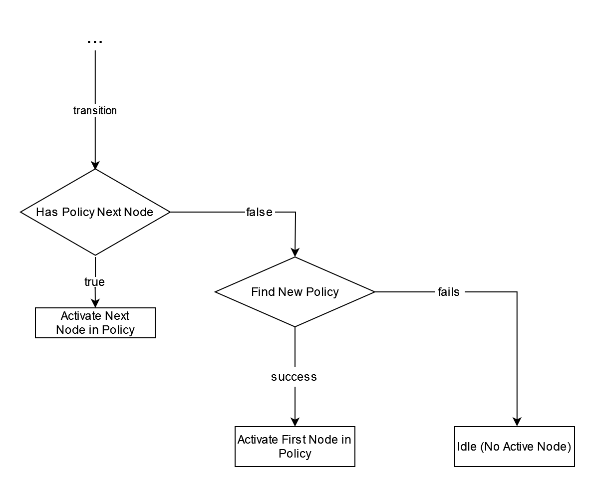
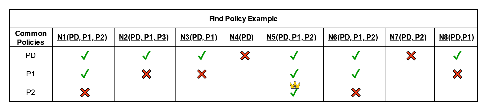
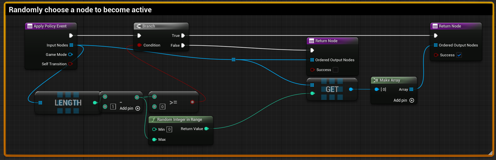
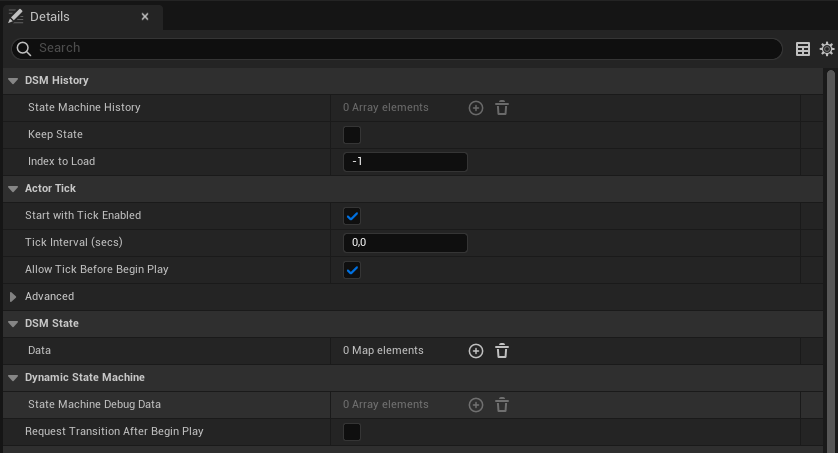

# DSM Transitions

## Theory

We already setup our level, created a custom ```DSM Node```, attached it to an actor in the world and set up the correct ```DSM Conditions```. The last missing part to activate our first custom  ```DSM Node``` is to trigger a transition inside the ```DSM Game Mode```, which manages the entire DSM system. 



When a transition is triggered, we always follow the state machine above.
Therefore, we need to know that every ```DSM Node``` can have one or more ```DSM Policies```. A policy basically resolves the decision problem, if multiple ```DSM Nodes``` wants to become active at the same time. The policy resolves the conflict and chooses a single next ```DSM Node``` or a sequence of ```DSM Nodes```, which will be activated in the given order. To evaluate a transition request, our initial step is to verify if the current policy offers a subsequent node for activation. If there is no active policy or the policy has no subsequent node, we enter the process of finding a new ```DSM Policy```. In case, there is no suitable ```DSM Policy``` for the current data state, the state machine transitions into ```Idle``` mode until a new transition is triggered. If the system finds a new valid ```DSM Policy```, we activate the first ```DSM Node``` found by the policy. After an active ```DSM Node``` ends, a transition is triggered automatically following the state machine above. 

## DSM Policies

In the section above the general transition process was described. The last part missing is the implementation of the ```Find New Policy``` process. To understand the finding process, let us have a look at the pseudo code of the ```DSM Default Policy```: 

```

ApplyPolicy(in : inputNodes, out : outputNodes, out : success)
{
	outputCandidates = []
	for(elem in inputNodes)
	{
		if (elem.CanEnterState())
		{
			outputCandidates.Add(elem)
		}
	}

	success = outputCandidates.Num() == 1
	outputNodes = outputCandidates
}

```

Each ```DSM Policy``` has a ```Priority``` value and an ```Apply Policy``` function. The ```Apply Policy``` function filters out ```DSM Nodes``` which are not applicable by the ```DSM Policy```. In the example described here all ```DSM Nodes```, which the ```CanEnterState``` method returns false are not applicable. The ```Apply Policy``` method also returns a success flag, which is true if the policy was successful. In the case described here, the policy is successful, if we only find a single considered ```DSM Node```. This does make sense, because if we only find a single ```DSM Node```, we can directly activate it. The last missing part is the ```Priority``` value. Based on the ```Priority``` value, the next applied policy is chosen. So if we have a set of N ```DSM Nodes``` which all have the same two policies. We would always apply the common policy, with the highest ```Priority``` first.  

During the ```Find New Policy``` process multiple policies can be applied to find the best fitting policy in the current situation. Let us see an example : 




When calling ```FindNewPolicy```, we first consider all existing nodes in the current level, which are registered at the ```DSM Game Mode```. In the first step, we try to find a common policy, which is supported by all DSM Nodes. In the example, the only policy supported by all nodes is ```PD (DSM Default Policy)```. We can not activate ```P1``` or ```P2```, because there are some Nodes like ```N4```, which do not support them. After selecting ```PD``` as our common policy, we call the ```ApplyPolicy``` method, which filters out some of the nodes. (Marked here as a red cross) In the second step, we try to find another policy, based on the output of the first policy, independantly of the success of the first policy. This works the same way as before, we activat policy ```P1```, because it is the only policy supported for all the remaining DSM Nodes. (We can not activate ```P2```, because some nodes like ```N3``` does not support this policy). We apply again the ```ApplyPolicy``` method and repeat the process until we can not find any new policies or there are no output nodes anymore. 

In the final step, we go trough all activated policies and choose the one with the highest priority, which was successful. This policy decides which```DSM Node``` becomes active next. In the example above, ```P2``` is the found policy and ```N5``` would be the ```DSM Node``` activated next. If there is no successful policy, the ```DSM Game Mode``` transitions to ```Idle```.  

## Pros and Cons of the approach

The biggest adavantage of this system is the flexibility. In case, we created a scene and there is an unexpected transition to Idle, there are multiple ways, how we can fix the problem. We can use our debug tools to check in the history, which DSM Nodes were involved, when transitioning to ```Idle``` mode. 
Now we have 2 choices, we either update the conditions of the involved ```DSM Nodes``` to make sure the correct ```DSM Node``` is chosen, or we can give all of the involved ```DSM Nodes``` a new ```DSM Policy``` which resolves the conflict. The system above is deterministic, so the involved nodes will always stay the same. This allows iterative development, where only the involved nodes have to be analyzed without the necessity to understand the remaining system.

On the drawback side, there is computational overhead compared to other solutions. To find the next node, in worst case we must consider all existing nodes multiple times for each transition. This is very unlikely in reality, because most of the conditions are not true at the same time, but theretically possible. Another solution to implement transitions would be to define a set of possible transition nodes for each ```DSM Node```. Solutions like that would benefit in performance on the costs of flexibility. Such systems would require to always understand the entire system, such that you can update the conditions for the involved nodes to fix the problem without any side effects. 

The tool described here was created with idea in mind of rapid prototyping. For this reason a more flexible implementation for transitioning was implemented.

## DSM Policies Practical Part

Policies can be created in ```C++``` or ```Blueprints```. Based on the complexity of a policy, it is recommended to use Blueprints for simple policies and C++ for complex policies. In order to create a C++ policy, you need to create a new C++ class and select ```DSMPolicy``` as base. The implementation is analogue to Blueprints which is shown next. You can find more complex C++ examples for ```DSM Policies``` inside ```DynamicStateMachine\Source\DynamicStateMachine\Classes\DSMPolicy.h``` .

## Create Blueprints DSM Policy

- Create a new Blueprint from Class ```DSMPolicy```
- Override the base function ```Apply Policy Event```

<p align="center">
	
</p>

- You can set in the Details Panel the ```Priortiy``` of the policy (```DSM Default Policy``` has a priority of 0)
- You can also tick the flag ```Transition After Policy```, if a transition should be performed after all ```DSM Nodes``` returned by the ```Apply Policy Event``` were activated
- Implement your beahavior inside the overriden ```Apply Policy Event``` 

Here is a small example for a policy, which chooses a random ```DSM Node``` from the input: 



| Input Parameter | Description|
| --------| -----------|
| Input Nodes| ```DSM Nodes``` considered for this policy. Filter the given nodes based on your custom behavior. |
| Game Mode| DSM Game Mode of the current level |
| Self Transition | Flag is true, when the underlying transition was triggered by a ```DSM Self Transition```, otherwise false. |


| Output Parameter | Description|
| --------| -----------|
| Ordered Output Nodes | Filtered DSM Input Nodes in activation order. Order only matters if ```Success``` flag is true. |
| Success| Set flag to true, if the policy was successful and applicable  ```DSM Output Node(s)``` could be found. Otherwise set it to false. |

After implementing the ```Apply Policy Event```, you are good to go. 

## Assign Policies to Nodes

Inside the ```Details Panel``` of a ```DSM Node```, you can add ```DSM Policies``` to the ```Node Policies``` array, as seen in the image below. 

<p align="center">
	
</p>

> **Note**
> The order of the policies inside the ```NodePolicies``` array does not matter. Please use the ```Priority``` value inside each ```DSM Policy``` to prioritize policies.


## Trigger DSM Transitions

Now that we understand the theoretical part of the DSM transitioning process, we have a look at the practical part which is much easier.

### Begin Play Transitions

On game start, the system is in ```Idle``` mode. We can tick the ```Request Transition After Begin Play``` flag inside your ```DSM Game Mode``` to start a transition as soon as the registration process of all nodes has finished.




This can be helpful, if you have some kind of opening scene which should always be played at the start of the game. 

### Global Runtime Transitions

The easiest way to trigger a transition is using the ```RequestDSMTransition``` method, which is a static method you can call everywhere in your code base.

<p align="center">
	
</p>

The function does not take any arguments, because as we learned earlier all nodes are always considered. It takes a boolean as an output parameter, which states if the transition was successful. In case, there is already an active node, ```Request DSM Transition``` returns false. If a transition could be triggered true is returned.

### DSM Self Transition

Sometimes a ```DSM Node``` is depending on some type of Input or Events. In these cases a ```DSM Node``` can try activate itself. It is important to know, that the self transition can only be performed from the ```DSM Node``` itself. Otherwise the assumption, that the entire behavior of a ```DSM Node``` is inside the node itself would be violated.


<p align="center">
	
</p>

In previous sections, we described an inventory example. Imagine we have an item, we want to collect. Then we could add a ```DSM Node``` to the item, which implements to collecting behavior. As soon as the player enters the collision box of the item, the attached ```DSM Node``` could perform a self transition to activate the collection behavior. The node works the same way as the general runtime transition, with the difference that the flag ```IsSelfTransitioned``` is set to true. So if your attached ```DSM Node``` should only get activated by self transitions, this would be the condition to enter the node.

<p align="center">
	
</p>


> **Note**
> After an active ```DSM Node``` is finished, a transition is executed based on the ```Transition After Policy``` flag inside the active policy. So a single transition can trigger a chain of transitions, before the ```DSM Game Mode``` goes back to ```Idle``` mode. 


## Conclusion

This section summarized the functionality of ```DSM Policies``` in the context of transitions. We also discussed the creation of cutom ```DSM Policies``` and the usage of transition in your game. 

[Next page](SaveAndLoad.md)


